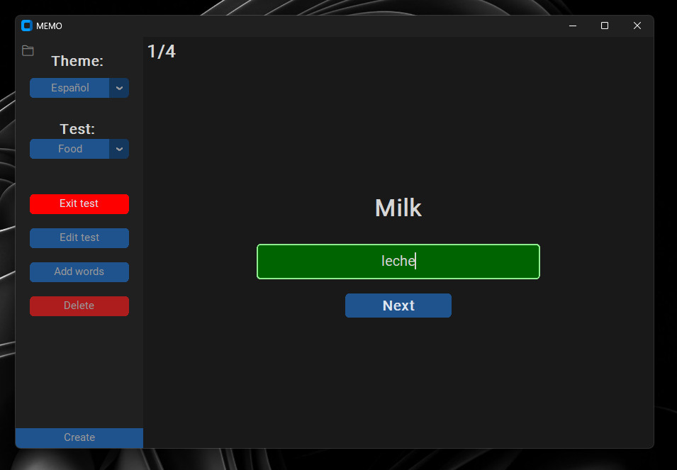

# MEMO  

This application was created for visual learners to help them store and memorize new words.  
When you study a new language and encounter a new word, you can quickly save it in the app.  
It’s very convenient for keeping words organized — you can separate them by **languages** and **topics**.  
By constantly passing tests, you’ll memorize new words much faster.  


---

## Proper usage  
- Don’t make tests longer than **30 words** — it hurts memorization and overwhelms you.  
- Split topics (verbs, nouns, etc.), so quizzes don’t become too easy just by guessing the type of word.  
- For new topics, start with **quizzes**. Once you get used to them, switch to **tests** — they require exact translations, letter by letter, making them harder but more effective.  

---

## How does it work  
- The app saves your tests in:  
  `C:/Users/<username>/AppData/Local/MEMO`  
- It works from a **single .exe file** with no dependencies — you can move it anywhere.  
- Tests are stored as `.test` files (plain text). You can open them with Notepad, but don’t mess with the format.  

---

## How to compile  
Requirements:  
- Python **3.10**  
- `customtkinter`  
- `PyInstaller`  

Steps:  
1. Create and activate a **virtual environment** (recommended, so extra junk doesn’t leak into the build).  
2. Install required libraries:  
   ```bash
   pip install customtkinter pyinstaller
3. Navigate to the folder with main.py.
4. Run:
   ```bash
   python -m PyInstaller --icon=assets/book.ico --name="MEMO" --onefile --noconsole --add-data="venv\Lib\site-packages\customtkinter;customtkinter/" main.py
⚠️ Note: customtkinter doesn’t play nicely with PyInstaller, so the command is very sensitive to changes. Even small edits can break the build.

> **Troubleshooting**  
> If compilation fails, check the [official Custom-Tkinter packaging guide](https://github.com/TomSchimansky/CustomTkinter/wiki/Packaging) for tips and solutions.

---

##  Download

You can download the latest compiled version of **MEMO** here:  
👉 [Latest Release](https://github.com/Uladislau-Kulikou/MEMO/releases/latest)

The release contains a single `.exe` file (~8 MB), ready to run—no dependencies or installation needed. Just download and launch to start learning.

